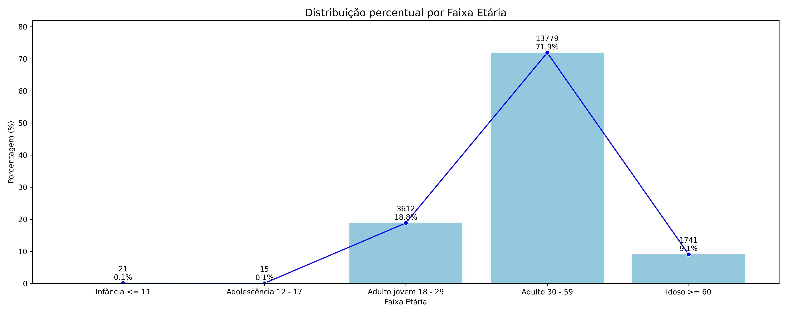
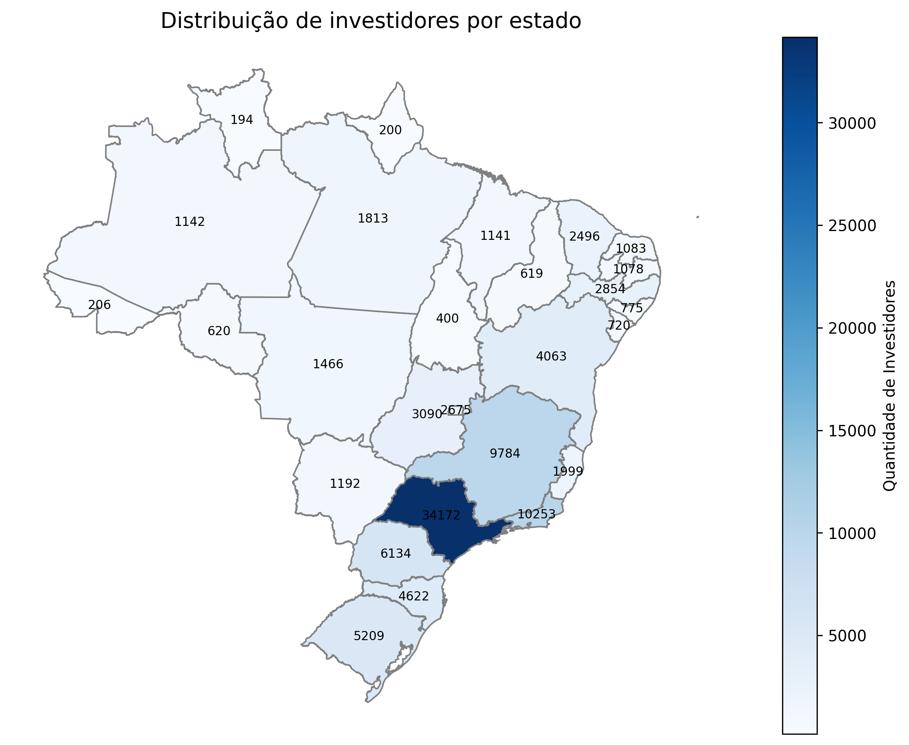
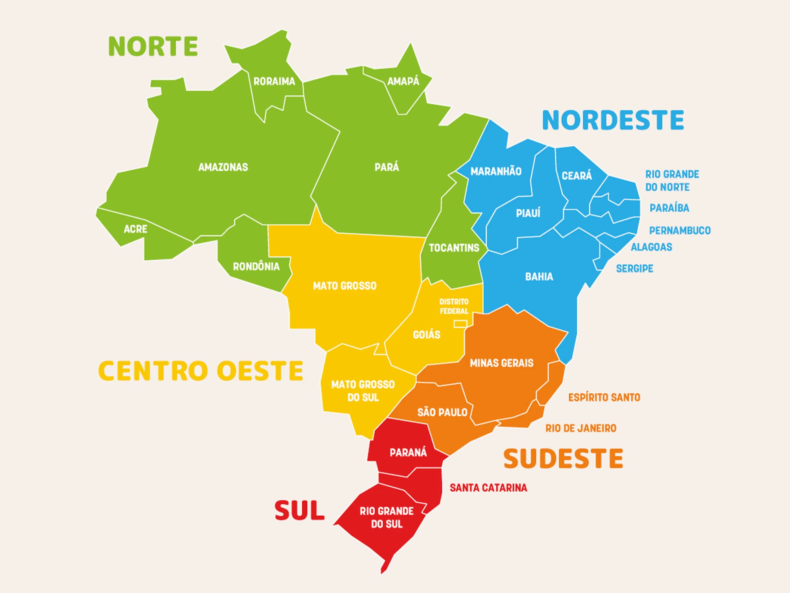

# Analises iniciais

As seguintes analises fazem parte do programa pantanal.dev, um programa de capacitação imersiva em tecnologias inovadoras que tem como objetivo capacitar e apresentar oportunidades de trabalho remoto no mercado financeiro nacional 💼.
Nesse contexto este documento trata da analise exploratoria de dados cujo objetivo é responder perguntas além das mais obvias geralmente proferidas a este tipo de dado.
Buscamos também outras bases de dados cujo o contexto encontra-se em determinada parte da analise. Como é o caso da base ESTBAN.

# Tesouro direto
Este conjunto de dados reúne informações sobre os investidores registrados no programa Tesouro Direto. Ele apresenta detalhes do perfil de cada investidor, como a data em que aderiu ao programa, sua profissão, cidade onde reside, estado civil, entre outros dados relevantes. Também estão incluídas informações sobre a situação atual do investidor, indicando se ele ainda participa ativamente do programa e se realizou operações nos últimos 12 meses. Cada investidor é identificado por um código único. Caso um mesmo investidor tenha registros em mais de uma instituição financeira, esses cadastros adicionais são apresentados em linhas separadas, utilizando o mesmo código de identificação.
Esta base pode ser encontrada através do link: https://www.tesourotransparente.gov.br/ckan/dataset/investidores-do-tesouro-direto

# Problema
Identificar agrupamentos de investidores com base em informações dadas pela base de dados do tesouro direto.

# Justificativa
O numero de investidores em em ativos de baixo risco tem crescendo uma vez que o mercado de ativos de alto risco possui grande volatividade dado ao contexto atual de dinâmicas economicas a nivel mundial.
Nesse contexto, identificar perfis de investidores não somente pela justificativa de agrupa-los mas sim de trazer novos capitais ativos ja consolidados, como o caso do tesouro direto.
Por isso, entender o comportamento de pessoas que já investem no ativo, pode ajudar direcionar esforços para novos investidores.

# Perguntas a serem respondidas
* ✅ Quais são as idades e como esta distribuido o dataset com relação ao investimento em tesouro direto?
* ✅ Considerando apenas os investidores ativos, a distribuição de idade se conserva?
* ✅ Qual o estado com o maior numeros de pessoas que investem em tesouro direto? 
* ✅ Qual a distribuição de genero mais presente no dataset?
* Como os investidores estão agrupados?
* Existe alguma relação entre o IDH de um estado e o investimento em tesouro direto?

# ✅Dicionario de dados
| Nome da Coluna         | Descrição                                                     | Tipo de Dado       | Categoria     |
| ---------------------- | ------------------------------------------------------------- | ------------------ | ------------- |
| `Codigo do Investidor` | Identificador único de cada investidor                        | Numérico (inteiro) | Identificador |
| `Data de Adesao`       | Data em que o investidor aderiu à plataforma                  | Data (string)      | Temporal      |
| `Estado Civil`         | Estado civil do investidor (ex: Solteiro(a), Casado(a))       | Categórico         | Qualitativo   |
| `Genero`               | Gênero do investidor (`M` para masculino, `F` para feminino)  | Categórico         | Qualitativo   |
| `Profissao`            | Profissão declarada do investidor                             | Categórico         | Qualitativo   |
| `Idade`                | Idade do investidor no momento do registro                    | Numérico (inteiro) | Quantitativo  |
| `UF do Investidor`     | Unidade Federativa (estado) do investidor (ex: SP, RJ)        | Categórico         | Geográfico    |
| `Cidade do Investidor` | Cidade onde o investidor reside                               | Categórico         | Geográfico    |
| `Pais do Investidor`   | País onde o investidor reside (provavelmente sempre "BRASIL") | Categórico         | Geográfico    |
| `Situacao da Conta`    | Situação atual da conta (ex: "D" para desativada)             | Categórico         | Status/Flag   |
| `Operou 12 Meses`      | Indica se o investidor operou nos últimos 12 meses (S/N)      | Categórico         | Binário       |

# 📁Resumo por Tipo de Dado
| Tipo de Dado  | Quantidade de Colunas | Colunas                                                                                                                                         |
| ------------- | --------------------- | ----------------------------------------------------------------------------------------------------------------------------------------------- |
| Numérico      | 2                     | `Codigo do Investidor`, `Idade`                                                                                                                 |
| Categórico    | 8                     | `Estado Civil`, `Genero`, `Profissao`, `UF do Investidor`, `Cidade do Investidor`, `Pais do Investidor`, `Situacao da Conta`, `Operou 12 Meses` |
| Data/Temporal | 1                     | `Data de Adesao`                                                                                                                                |

# 📊 Estatísticas da Base de Dados
Quantidade de Instâncias (linhas): 100.000 <br>
Quantidade de Características (colunas): 11


# EDA (Exploratory Data Analysis) dos dados

Agrupando os dados utilizando a seguinte logica

```python
def classificar_idade(idade):
            if idade <= 11:
                return 'Infância <= 11'
            elif idade <= 17:
                return 'Adolescência 12 - 17'
            elif idade <= 29:
                return 'Adulto jovem 18 - 29'
            elif idade <= 59:
                return 'Adulto 30 - 59'
            else:
                return 'Idoso >= 60'
```
Obtemos a figura-1 mostrando a distribuição dos dados de idade. Como podemos notar pessoas entre 30 a 59 anos de dados são mais presentes no dataset 
<table>
  <tr>
    <td align="center">
      <br>
      <sub><b>Distribuição de idades de contas atividas</b></sub>
    </td>
    <td align="center">
      <br>
      <sub><b>Distribuição de idades de contas atividas</b></sub>
    </td>
    <td align="center">
      <br>
      <sub><b>Distribuição de idades no total</b></sub>
    </td>
  </tr>
</table>

O que também é constatado é que a distribuição se conserva mesmo se tratando de contas atividas ou desativadas

## Agrupando por estado por estado podemos ver os que mais se destacam na participação da base de dados


<table>
  <tr>
    <td align="center">
      <br>
      <sub><b>Distribuição de idades de contas atividas</b></sub>
    </td>
    <td align="center">
      <br>
      <sub><b>Regiões do Brasil</b></sub>
    </td>
    <td align="center">
      <br>
      <sub><b>Distribuição de investidores por estado</b></sub>
    </td>
  </tr>
</table>


