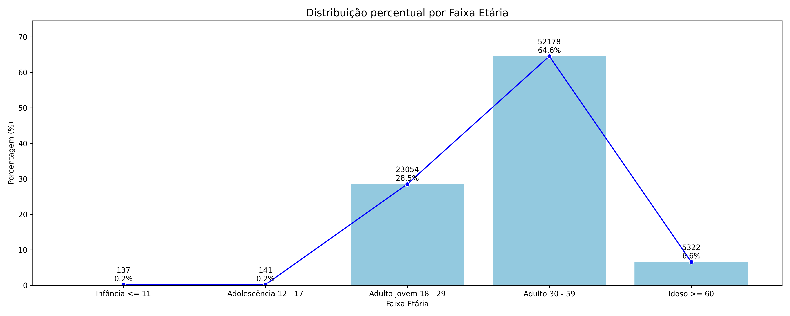
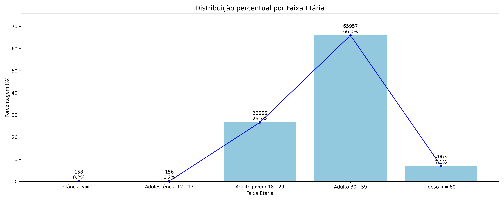
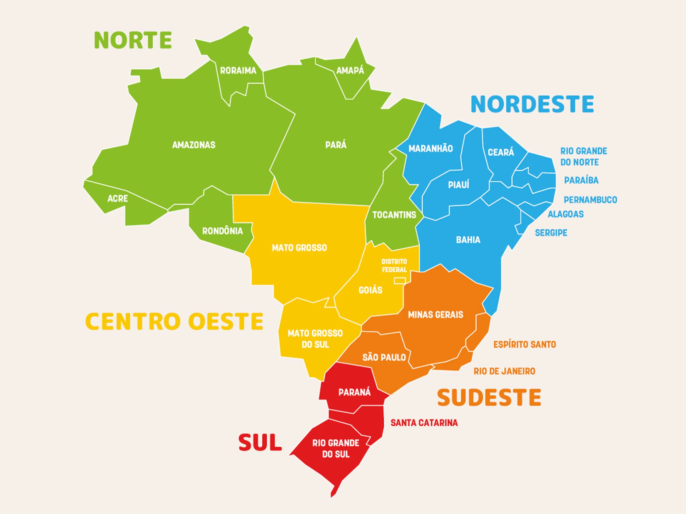
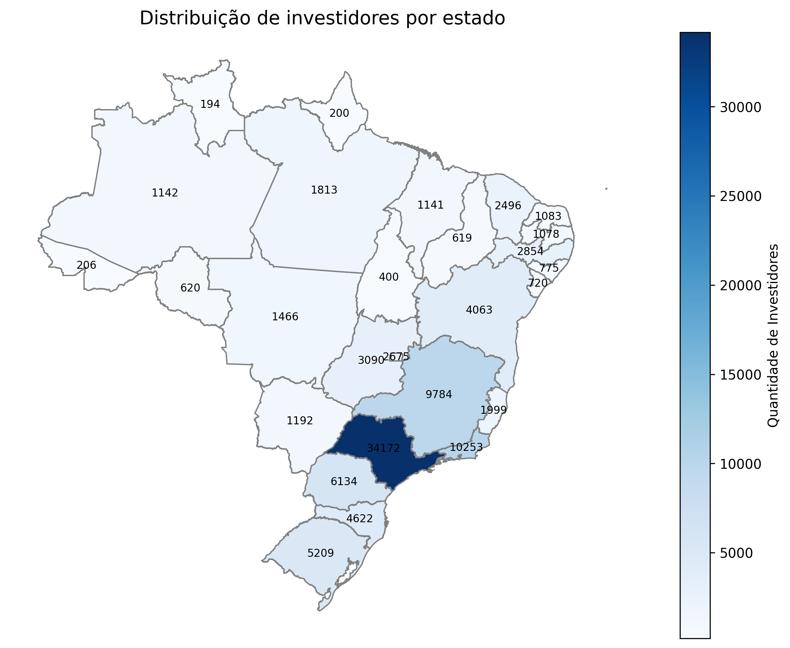
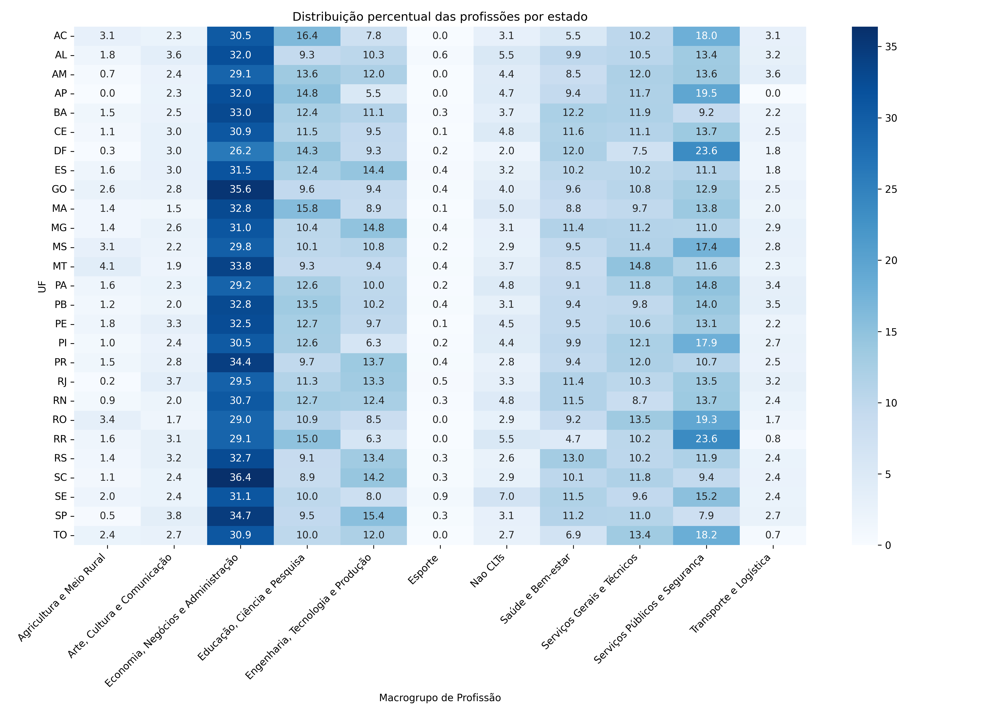

# 📊 Análises Iniciais

Este repositório faz parte do **Pantanal.dev**, um programa de capacitação imersiva em tecnologias inovadoras, com foco na geração de oportunidades de trabalho remoto no mercado financeiro nacional 💼.

O objetivo deste projeto é realizar uma análise exploratória dos dados, buscando responder perguntas além das análises tradicionais normalmente feitas com este tipo de dado. Durante o processo, também utilizamos bases complementares, como a **ESTBAN**, para enriquecer os insights obtidos.

---

## 📈 Base de Dados: Tesouro Direto

O conjunto de dados utilizado contém informações sobre investidores do programa **Tesouro Direto**. Cada registro traz detalhes do perfil do investidor, como:

- Data de adesão
- Profissão
- Localização (cidade e estado)
- Estado civil
- Gênero
- Situação atual da conta (ativa ou não)
- Operações realizadas nos últimos 12 meses

Cada investidor possui um **identificador único**, mas, caso tenha contas em mais de uma instituição financeira, aparecem como registros distintos, porém com o mesmo código.

🔗 A base de dados está disponível em:  
[https://www.tesourotransparente.gov.br/ckan/dataset/investidores-do-tesouro-direto](https://www.tesourotransparente.gov.br/ckan/dataset/investidores-do-tesouro-direto)

---

## 🎯 Problema

**Como identificar agrupamentos de investidores a partir das informações disponíveis na base do Tesouro Direto?**  

---

## 💡 Justificativa

O número de investidores em ativos de baixo risco, como o Tesouro Direto, tem crescido significativamente. Isso se deve à alta volatilidade dos ativos de risco, influenciada pelas dinâmicas econômicas globais.

Diante desse cenário, entender o perfil dos investidores atuais é estratégico. Esse conhecimento não apenas permite agrupar perfis semelhantes, mas também auxilia na formulação de estratégias para atrair novos investidores e fortalecer o mercado.

---

## ❓ Perguntas a Serem Respondidas

- ✅ **Quais são as idades e como está distribuída a base em relação ao investimento no Tesouro Direto?**
- ✅ **A distribuição de idade se mantém considerando apenas investidores ativos?**
- ✅ **Qual é o estado com o maior número de investidores?**
- ✅ **Qual é a distribuição de gênero presente na base?**
- 🔍 **Como os investidores estão agrupados?**
- 🔍 **Existe relação entre o IDH dos estados e o investimento no Tesouro Direto?**

## 🗂️ Dicionário de Dados
| Nome da Coluna         | Descrição                                                     | Tipo de Dado       | Categoria     |
| ---------------------- | ------------------------------------------------------------- | ------------------ | ------------- |
| `Codigo do Investidor` | Identificador único de cada investidor                        | Numérico (inteiro) | Identificador |
| `Data de Adesao`       | Data em que o investidor aderiu à plataforma                  | Data (string)      | Temporal      |
| `Estado Civil`         | Estado civil do investidor (ex: Solteiro(a), Casado(a))       | Categórico         | Qualitativo   |
| `Genero`               | Gênero do investidor (`M` para masculino, `F` para feminino)  | Categórico         | Qualitativo   |
| `Profissao`            | Profissão declarada do investidor                             | Categórico         | Qualitativo   |
| `Idade`                | Idade do investidor no momento do registro                    | Numérico (inteiro) | Quantitativo  |
| `UF do Investidor`     | Unidade Federativa (estado) do investidor (ex: SP, RJ)        | Categórico         | Geográfico    |
| `Cidade do Investidor` | Cidade onde o investidor reside                               | Categórico         | Geográfico    |
| `Pais do Investidor`   | País onde o investidor reside (provavelmente sempre "BRASIL") | Categórico         | Geográfico    |
| `Situacao da Conta`    | Situação atual da conta (ex: "D" para desativada)             | Categórico         | Status/Flag   |
| `Operou 12 Meses`      | Indica se o investidor operou nos últimos 12 meses (S/N)      | Categórico         | Binário       |

## 🔢 Resumo dos Dados
| Tipo de Dado  | Quantidade de Colunas | Colunas                                                                                                                                         |
| ------------- | --------------------- | ----------------------------------------------------------------------------------------------------------------------------------------------- |
| Numérico      | 2                     | `Codigo do Investidor`, `Idade`                                                                                                                 |
| Categórico    | 8                     | `Estado Civil`, `Genero`, `Profissao`, `UF do Investidor`, `Cidade do Investidor`, `Pais do Investidor`, `Situacao da Conta`, `Operou 12 Meses` |
| Data/Temporal | 1                     | `Data de Adesao`                                                                                                                                |

## 📊 Estatísticas da Base de Dados
Quantidade de Instâncias (linhas): 100.000 <br>
Quantidade de Características (colunas): 11


# EDA (Exploratory Data Analysis) dos dados

Agrupando os dados utilizando a seguinte logica

```python
def classificar_idade(idade):
            if idade <= 11:
                return 'Infância <= 11'
            elif idade <= 17:
                return 'Adolescência 12 - 17'
            elif idade <= 29:
                return 'Adulto jovem 18 - 29'
            elif idade <= 59:
                return 'Adulto 30 - 59'
            else:
                return 'Idoso >= 60'
```
Obtemos a figura-1 mostrando a distribuição dos dados de idade. Como podemos notar pessoas entre 30 a 59 anos de dados são mais presentes no dataset 
<table>
  <tr>
    <td align="center">
      <br>
      <sub><b>Distribuição de idades de contas ATIVADAS</b></sub>
    </td>
    <td align="center">
      <br>
      <sub><b>Distribuição de idades de contas DESATIVADAS</b></sub>
    </td>
    <td align="center">
      <br>
      <sub><b>Distribuição de idades no total</b></sub>
    </td>
  </tr>
</table>

O que também é constatado é que a distribuição se conserva mesmo se tratando de contas atividas ou desativadas

## Agrupando por estado podemos ver os que mais se destacam na participação da base de dados
<table>
  <tr>
    <td align="left">
      <!-- <br> -->
      <h1><b>Quantidade de investidores vs IDH-M 2021</b></h1>
      <h3>
      Correlação de Pearson: 0.570 <br>
      P-valor: 0.00192 <br>
      Correlação de Spearman: 0.681325
      </h3>
    </td>
    <td align="center">
      <br>
      <sub>
        <b>Regiões do Brasil</b><br>
        Fonte: https://www.todamateria.com.br/regioes-brasileiras/
      </sub>
    </td>
    <td align="center">
      <br>
      <sub><b>Distribuição de investidores por estado</b></sub>
    </td>
  </tr>
</table>

## 📊 Distribuição percentual das profissões por estado

Este gráfico mostra como as profissões estão distribuídas percentualmente em cada estado, com base nos dados dos investidores do Tesouro Direto.

<p align="center">
  
</p>

O que indica um comportamento bem diferente para cada profissão por estado.


